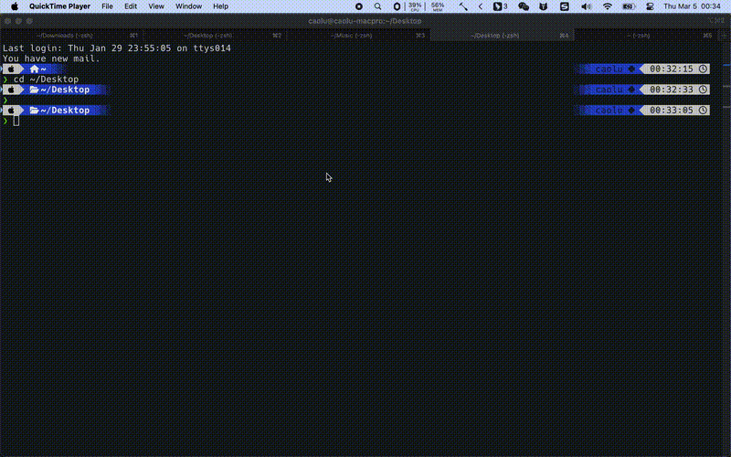

# iTerm2 Tabs

<div align="center">

**A Fast Tab Switcher for iTerm2**

[](https://www.python.org/downloads/)
[](LICENSE)

English | [简体中文](README.md)

</div>

## ✨ Features

- 🎯 **Fast Switching** - View and switch between all iTerm2 tabs instantly
- ⌨️ **Keyboard Navigation** - Navigate with arrow keys (↑↓), select with Enter
- 🔍 **Real-time Search** - Filter tabs by typing keywords
- 🎨 **Modern UI** - Clean and beautiful interface with dark/light themes
- 🚀 **Standalone App** - Packaged as macOS .app, supports Spotlight launch
- 🌓 **Theme Support** - Supports both dark and light themes

## 📸 Preview

### Demo



### Interface Schematic

```
┌─────────────────────────────────────────┐
│              iTerm2 Tabs                 │
├─────────────────────────────────────────┤
│ 🔍 [Search tabs...]                     │
├─────────────────────────────────────────┤
│ [1] vim (ssh)                           │
│ [1] ~/project (-zsh)                    │
│ [1] ✳ Claude Code (node)               │
│ [2] tail -f log.txt                    │
│                                          │
│ ↑↓ Navigate | Enter: Select | Esc: Close│
└─────────────────────────────────────────┘
```

## ⚠️ Important

**Before using this app, you MUST enable iTerm2 Python API:**

1. Open iTerm2
2. Go to `iTerm2 > Preferences > General`
3. Find the `Magic` section
4. Check ✅ `Enable Python API`


**The app will NOT work without Python API enabled!**

## 📦 Installation

### Option 1: Download macOS App (Recommended)

1. Go to [Releases](https://github.com/yourusername/iterm2-Tabs/releases)
2. Download the latest `iterm2-tabs.app.zip`
3. Unzip and move to Applications:

```bash
unzip iterm2-tabs.app.zip
cp -R iterm2-tabs.app /Applications/
```

4. Launch for the first time:
```bash
open /Applications/iterm2-tabs.app
```

5. After that, launch via Spotlight (⌘ + Space) by searching "iTerm2 Tabs"

### Option 2: Development with uv

#### Prerequisites

- macOS 10.15+
- Python 3.12+
- iTerm2 3.4+ (with Python API enabled)

#### Installation Steps

```bash
# 1. Clone the repository
git clone https://github.com/yourusername/iterm2-Tabs.git
cd iterm2-Tabs

# 2. Install uv (if not installed)
curl -LsSf https://astral.sh/uv/install.sh | sh

# 3. Create virtual environment (Python 3.12)
uv venv --python 3.12

# 4. Install dependencies
uv sync

# 5. Run the app
uv run python -m iterm2_tabs
```

### Option 3: Using pip

```bash
# 1. Clone the repository
git clone https://github.com/yourusername/iterm2-Tabs.git
cd iterm2-Tabs

# 2. Create virtual environment
python3 -m venv venv
source venv/bin/activate

# 3. Install dependencies
pip install -e .

# 4. Run the app
python -m iterm2_tabs
```

## 🚀 Usage

### Launching the App

#### From macOS App

```bash
# Method 1: Use Spotlight
# Press ⌘ + Space, type "iTerm2 Tabs", press Enter

# Method 2: Launch from command line
open -a "iterm2-tabs"
```

#### From Command Line

```bash
# Using uv
uv run python -m iterm2_tabs

# Or using virtual environment
source venv/bin/activate
python -m iterm2_tabs
```

### Keyboard Shortcuts

| Key | Action |
|-----|--------|
| `↑` / `↓` | Navigate up/down |
| `Enter` | Select current tab |
| `Esc` | Close window |
| Type | Real-time search |

### iTerm2 Global Hotkey (Recommended)

Create a custom hotkey in iTerm2:

1. Open `iTerm2 > Preferences > Keys`
2. Click `+` to add new keybinding
3. Set your preferred shortcut (e.g., `⌘ + ⇧ + T`)
4. Action: `Run Command...`
5. Command:
   ```bash
   # For macOS App
   open -a "iterm2-tabs"

   # For command-line version
   /path/to/python -m iterm2_tabs
   ```

## ⚙️ Configuration

Create `~/.iterm2-tabs-config.json`:

```json
{
  "window_width": 600,
  "window_height": 400,
  "show_window_number": true,
  "show_path": true,
  "theme": "dark",
  "font_size": 12
}
```

### Configuration Options

| Option | Type | Default | Description |
|--------|------|---------|-------------|
| `window_width` | int | 600 | Window width |
| `window_height` | int | 400 | Window height |
| `show_window_number` | bool | true | Show window number |
| `show_path` | bool | true | Show working directory |
| `theme` | string | "dark" | Theme: `dark` or `light` |
| `font_size` | int | 12 | Font size |

## 🛠️ Development

### Development Setup

```bash
# 1. Clone the repository
git clone https://github.com/yourusername/iterm2-Tabs.git
cd iterm2-Tabs

# 2. Install uv
curl -LsSf https://astral.sh/uv/install.sh | sh

# 3. Create development environment
uv venv --python 3.12
uv sync

# 4. Install dev tools
uv add --dev pytest black ruff mypy
```

### Common Commands

```bash
# Run the app
make run

# Run tests
make test

# Format code
make format

# Lint code
make lint

# Build macOS App
make dist

# Clean build files
make clean
```

### Project Structure

```
iterm2-Tabs/
├── src/iterm2_tabs/
│   ├── __init__.py          # Package entry
│   ├── __main__.py          # CLI entry
│   ├── app.py               # Main application logic
│   ├── config.py            # Configuration management
│   ├── gui.py               # GUI interface
│   └── iterm2_connection.py # iTerm2 API connection
├── scripts/
│   ├── build_app.sh         # Build macOS App
│   ├── release.sh           # Release script
│   └── bump-version.sh      # Version bump script
├── tests/                   # Test files
├── docs/                    # Documentation
└── pyproject.toml          # Project configuration
```

## 🐛 Troubleshooting

### Issue: "iTerm2 is not running!"

**Cause**: iTerm2 is not running or Python API is not enabled

**Solution**:
1. Make sure iTerm2 is running
2. Go to `iTerm2 > Preferences > General > Magic`
3. Check `Enable Python API`
4. Restart iTerm2

### Issue: Interface shows but no tabs

**Cause**: iTerm2 Python API connection failed

**Solution**:
1. Check if iTerm2 has open tabs
2. Check logs: `~/Library/Logs/iterm2-tabs.log`
3. Enable debug mode: `ITERM2_TABS_DEBUG=1 python -m iterm2_tabs`

### Issue: Clicking tab doesn't switch

**Cause**: iTerm2 window didn't get focus

**Solution**:
1. Manually click on iTerm2 window
2. Or set up global hotkey in iTerm2 (see above)

### Issue: macOS App won't open

**Cause**: Security settings blocked unsigned app

**Solution**:
1. Right-click the app, select "Open"
2. Or allow in System Settings:
   `Settings > Privacy & Security > Still allow`

## 📝 Changelog

See [CHANGELOG.md](CHANGELOG.md) for version history.

## 🤝 Contributing

Contributions are welcome! Please feel free to submit a Pull Request.

1. Fork the repository
2. Create your feature branch (`git checkout -b feature/AmazingFeature`)
3. Commit your changes (`git commit -m 'Add some AmazingFeature'`)
4. Push to the branch (`git push origin feature/AmazingFeature`)
5. Open a Pull Request

## 📄 License

This project is licensed under the MIT License - see [LICENSE](LICENSE) file for details

## 🙏 Acknowledgments

- [iTerm2 Python API](https://iterm2.com/python-api) - Powerful iTerm2 automation interface
- [uv](https://github.com/astral-sh/uv) - Extremely fast Python package manager

## 📧 Contact

- GitHub: [@yourusername](https://github.com/yourusername)
- Issues: [GitHub Issues](https://github.com/yourusername/iterm2-Tabs/issues)

---

**⭐ If this project helps you, please give it a Star!**
